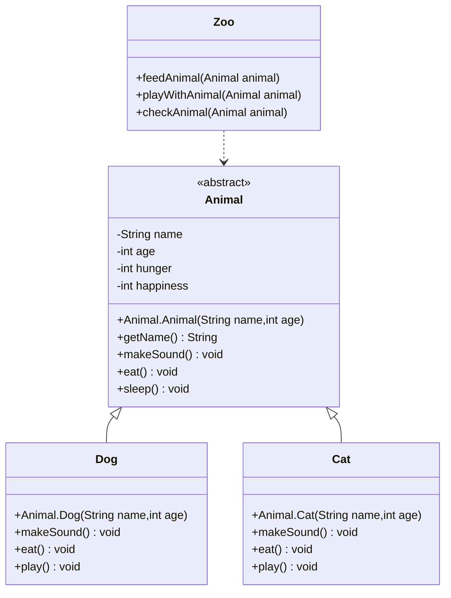

```mermaid
    classDiagram
        class Animal{   
            <<abstract>>
            -String name
            -int age
            -int hunger
            -int happiness
            +Animal.Animal(String name,int age)
            +getName() String
            +makeSound() void
            +eat() void
            +sleep() void            
        }
        
        class Dog{
            +Animal.Dog(String name,int age)
            +makeSound() void           
            +eat() void
            +play() void
        }
        Animal <|-- Dog
        
        class Cat{
            +Animal.Cat(String name,int age)
            +makeSound() void
            +eat() void
            +play() void
        }
        Animal <|-- Cat
        
        class Zoo{
            +feedAnimal(Animal animal)
            +playWithAnimal(Animal animal)
            +checkAnimal(Animal animal)             
        }
        Zoo ..> Animal
        

```