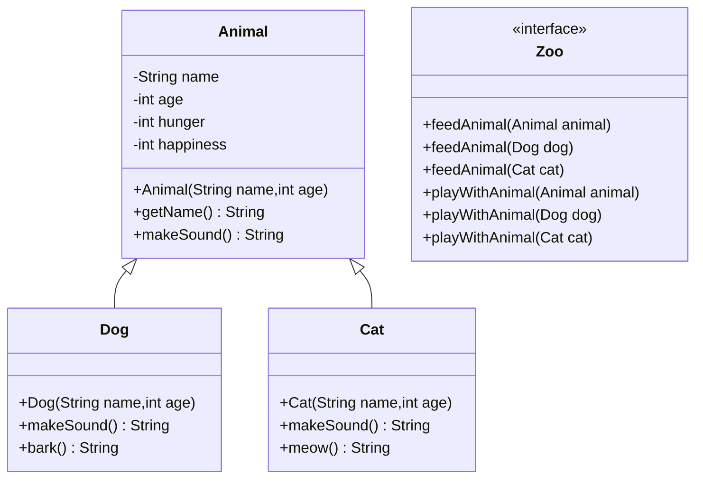

```mermaid
    classDiagram
        class Animal{
            
            -String name
            -int age
            -int hunger
            -int happiness
            +Animal(String name,int age)
            +getName() String
            +makeSound() String
            
        }
        class Dog{
            +Dog(String name,int age)
            +makeSound() String
            +bark() String
        }
        Animal <|-- Dog
        
        class Cat{
            +Cat(String name,int age)
            +makeSound() String
            +meow() String
        }
        Animal <|-- Cat
        
        class Zoo{
            <<interface>>
            +feedAnimal(Animal animal)
            +feedAnimal(Dog dog)
            +feedAnimal(Cat cat)
            +playWithAnimal(Animal animal)
            +playWithAnimal(Dog dog)
            +playWithAnimal(Cat cat)
        }
        

```